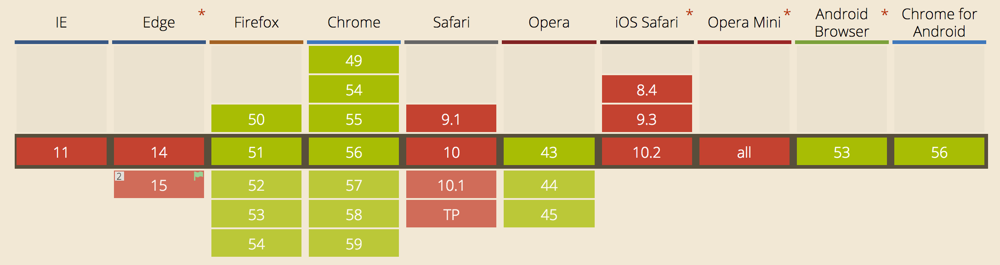
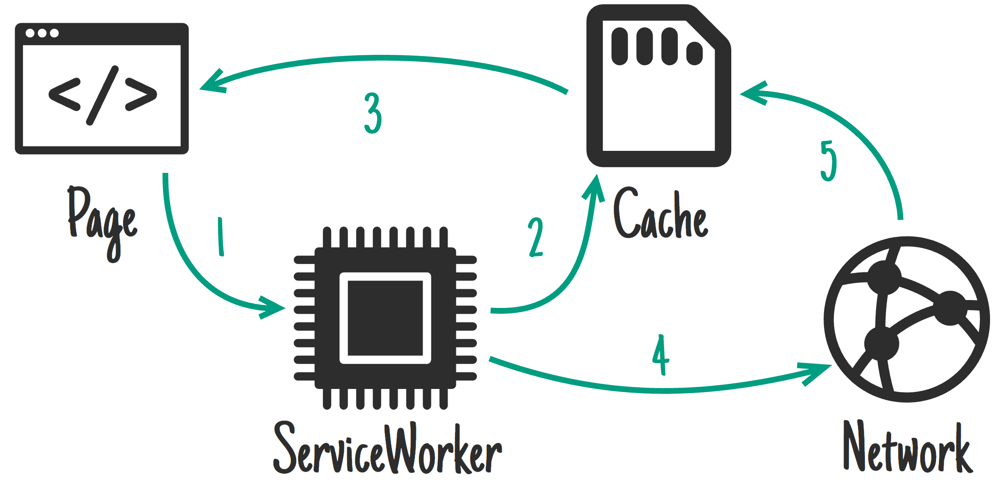

class: center, middle

# Service Workers

[github.com/hontas/avegaServiceWorker](https://github.com/hontas/avegaServiceWorker)

---
class: center, we-can-do-it


---

class: center, we-can-do-it


---

# Agenda

- [What are Service Workers?](#what-are-sw)
- [Browser support](#browser-support)
- [Basic usage](#basic-usage)
- [SW Lifecycle](#sw-lifecycle)
- [SW Strategies](#sw-strategies)
- [Examples](#examples)
- [To the stars and beyond](#to-the-stars)
- [Links](#links)

---
name: what-are-sw

# What are Service Workers?

???
vilka vet/ har använt?

--

> A script that runs in the background, separate from a web page. Can intercept and handle network requests and programmatically manage a cache.

???

nätverksproxy

--

- Requires HTTPS
- Support offline
- Can't access the DOM
- Cannot rely on global state

???
HTTPS: unless localhost, Having modified network requests wide open to man in the middle attacks would be really bad

offline: by caching assets and using them for response & IndexedDB API

Global state: terminated when not in use, restarted when  needed

---
name: what-are-sw-image

# What are Service Workers?


???
page -> serviceWorker -> network

avbryta svara med annat (cache/hittepå)

modifiera svaret innan det går tillbaka

---
name: browser-support

# Browser support

[](http://caniuse.com/#feat=serviceworkers "caniuse.com/#feat=serviceworkers")

[jakearchibald.github.io/isserviceworkerready](https://jakearchibald.github.io/isserviceworkerready/)

???

Edge: In development

Safari: Under consideration, Brief positive signals in five year plan.

---
name: basic-usage

# Basic usage

```js
if ('serviceWorker' in navigator) { // progressive enhancement
  window.addEventListener('load', function() {
    navigator.serviceWorker.register('sw.js')
      .then(function(registration) { /* registration success */ })
      .catch(function(err) { /* registration failure */ });
  });
}
```

--


???

The service worker will catch requests from the clients __under__ scope only

Must be server over https

The max scope is the location of the worker

---
name: sw-lifecycle

# SW Lifecycle

```js
self.addEventListener('install', function(event) {
  event.waitUntil();
});

self.addEventListener('activate', function(event) {
  event.waitUntil();
});

self.addEventListener('fetch', function(event) {
  event.respondWith();
});
```

???
andra events:

sync

message

onnotificationclick

--

[sw-lifecycle-image#1](https://mdn.mozillademos.org/files/12636/sw-lifecycle.png) | [sw-lifecycle-image#2](https://developers.google.com/web/fundamentals/getting-started/primers/imgs/sw-lifecycle.png)

???

install: Ideal for: CSS, images, fonts, JS, templates… basically anything you'd consider static to that "version" of your site.

activate: Ideal for: Clean-up & migration.
---
name: sw-strategies

# SW Strategies

 - Cache only
 - Network only
 - Cache, falling back to network
 - Cache & network race
 - Network falling back to cache
 - Cache then network
 - Generic fallback
 - ServiceWorker-side templating

???

Generic fallback: cache, then netwrk then other cache (offline)

ServiceWorker-side templating: create response

---
name: examples

# Examples

[http://localhost:3000](http://localhost:3000)

--
name: examples-2

staleWhileRevalidate



???
Startsidan: nada -> devTools

1: precache

2: cacha allt - stale while revalidate

3: trixar med responsen

4: custom 404 och offline-sida

5: save for later

---
name: to-the-stars

# To the stars and beyond

- [IndexedDB](https://developer.mozilla.org/en-US/docs/Web/API/IndexedDB_API)
- [Push Notifications](https://developers.google.com/web/fundamentals/getting-started/codelabs/push-notifications/)
- [Background Sync](https://developers.google.com/web/updates/2015/12/background-sync)

---
name: links

# Links 1/2

[is serviceworker ready?](https://jakearchibald.github.io/isserviceworkerready/)

### Talks
  - [Instant-loading Offline-first](https://www.youtube.com/watch?v=qDJAz3IIq18 "Progressive Web App Summit 2016")
  - [Supercharged: Live Coding Session](https://youtu.be/X8EQSy-ajo4?list=PLNYkxOF6rcIBz9ACEQRmO9Lw8PW7vn0lr "Chrome Dev Summit 2016")

### Articles
  - [Service Workers: an Introduction (google)](https://developers.google.com/web/fundamentals/getting-started/primers/service-workers)
  - [Service Worker API (mdn)](https://developer.mozilla.org/en-US/docs/Web/API/Service_Worker_API)
  - [Using Service Workers (mdn)](https://developer.mozilla.org/en-US/docs/Web/API/Service_Worker_API/Using_Service_Workers)
  - [The Service Worker Lifecycle (google)](https://developers.google.com/web/fundamentals/instant-and-offline/service-worker/lifecycle)

---
name: links-2

# Links 2/2

### Examples
  - [The offline cookbook](https://jakearchibald.com/2014/offline-cookbook/)
  - [Service worker demos](https://github.com/jakearchibald/isserviceworkerready/tree/master/src/demos)
  - [Service Worker Recipes (chrome)](https://github.com/GoogleChrome/samples/tree/gh-pages/service-worker)
  - [The Service Worker Cookbook (mozilla)](https://serviceworke.rs/)

### Tools
  - [chrome://inspect/#service-workers](chrome://inspect/#service-workers) & [chrome://serviceworker-internals](chrome://serviceworker-internals)
  - [sw-precache](https://github.com/GoogleChrome/sw-precache) & [sw-toolbox](https://github.com/GoogleChrome/sw-toolbox)


